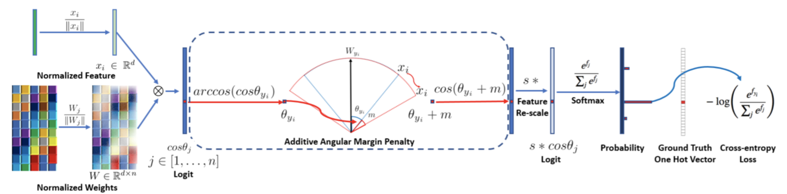

# insightface

The pytorch implementation of [insightface](https://github.com/deepinsight/insightface)



The following picture is based on [arcface](https://arxiv.org/pdf/1801.07698.pdf).

# Method

  The method is the same as [insightface](https://github.com/deepinsight/insightface).


# How to use 

+ Prepare Dataset

  Download & preprocess dataset

  It receives data in the existing rec format from [insightface](https://github.com/deepinsight/insightface) dataset-zoo.

  rec data is decompressed to make it into jpg format so that data in rec format can be used in pytorch.

  ```
  python data/prepare_data.py 

  usage: data/prepare_data.py  [--r REC_DATA_PATH]

  optional arguments:
        --rec_data_path REC_DATA_PATH Path where rec data file is stored  
  ```
        
+ Train
  
  After modifying each value in config.py, run the following command to learn.
  
  ```
  python train.py
  
  usage: train.py  

  optional arguments:
  
  ```
  
+ Test
  
  To test the learned best model against lfw, run the following command to learn.
  
  ```
  python all_pair_test.py
  
  usage: all_pair_test.py  

  optional arguments: 
  
  ```
  
+ Dataset merge
  
  By merging two or more rec data through the trained model, the training data is further expanded and the performance of the model is improved.
  
  The method simply extracts the average embedding for each id through a model trained on two or more rec data. 
  The extracted embedding was compared. if it exceeded a certain threshold, it was judged as the same person, 
  and if it was not exceeded, it was judged as another person and included.
  
  ```
  python dataset_merge/dataset_merge.py
  
  usage: dataset_merge/dataset_merge.py [--r REC_DATA_PATH]

  optional arguments:
        --merge MERGE_DATA_PATHS Path where rec data files are stored  
        --output OUTPUT_PATH Path where merged rec data file is stored 
        --model MODEL_PATH Path where model is stored 
        --batch-size BATCH_SIZE Number of images to put in the model at one time
        --t TRESHOLD Threshold to distinguish between same person or different person
  ```

# Results

# To Do
+ modify code 
+ add image

# Reference
Jiankang Deng and Jia Guo and Stefanos Zafeiriou(2018), ArcFace: Additive Angular Margin Loss for Deep Face Recognition

[paper](https://arxiv.org/pdf/1801.07698.pdf)  [code](https://github.com/deepinsight/insightface)
